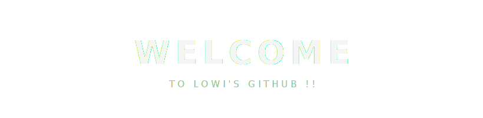
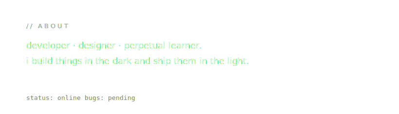
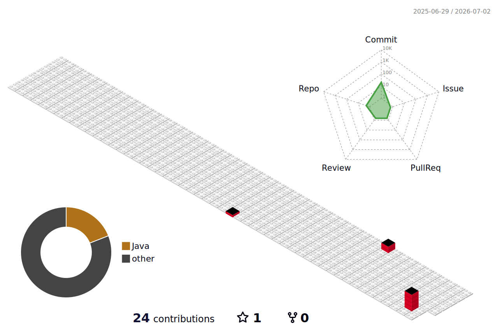
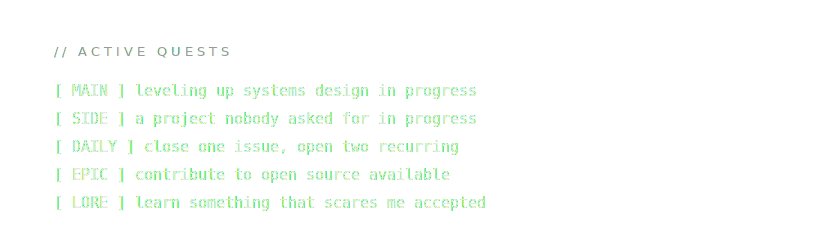

 

 

<h3 align="center">✦ &nbsp; L O A D O U T &nbsp; ✦</h3>

  <b>LANGUAGES</b> 
  
  
  
  
  

  <b>FRONTEND</b> 
  
  
  
  

  <b>BACKEND</b> 
  
  
  
  

  <b>TOOLING</b> 
  
  
  
  
  

 

<h3 align="center">✦ &nbsp; P L A Y E R   D A T A &nbsp; ✦</h3>

  
  

 

<h3 align="center">✦ &nbsp; C O M B A T   L O G &nbsp; ✦</h3>

contribution activity over time

  

 

<h3 align="center">✦ &nbsp; T H E   3 D   A R E N A &nbsp; ✦</h3>

[ACTION] isometric contribution calendar

  

 

<h3 align="center">✦ &nbsp; D E E P   S T A T S &nbsp; ✦</h3>

[ACTION] generated by the metrics engine

  

 

<h3 align="center">✦ &nbsp; A C H I E V E M E N T S &nbsp; ✦</h3>

  

 

 

<h3 align="center">✦ &nbsp; P A C - M A N &nbsp; ✦</h3>

commits are dots · your best days become power pellets

<picture>
  <source media="(prefers-color-scheme: dark)" srcset="https://raw.githubusercontent.com/lowii0/lowii0/output/pacman-contribution-graph-dark.svg" />
  <source media="(prefers-color-scheme: light)" srcset="https://raw.githubusercontent.com/lowii0/lowii0/output/pacman-contribution-graph.svg" />
  
</picture>

 

  

<i>code is never finished — it only respawns.</i>

